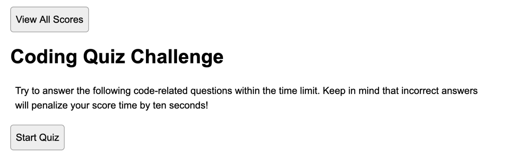
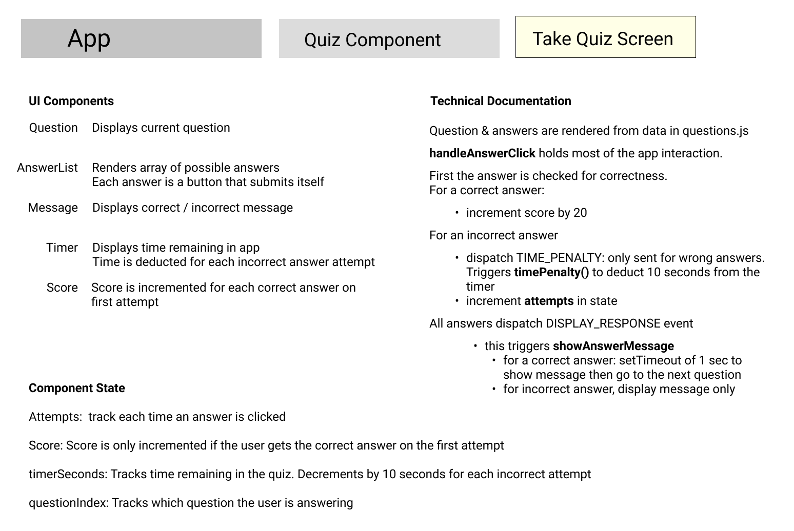

# Timed Javascript Quiz

## About
Timed quiz testing basic javascript knowledge with a countdown timer and scoreboard

## Try it
Take the quiz here: https://bvasko.github.io/timed-JS-quiz/

## Screenshots

## Technical Documentation
### Running the app locally
This app is vanilla JS and uses no frameworks.
Data for the quiz is found in questions.js
All interactivity is contained in main.js

### App Setup

## License
GNU General Public License
## Credits

CSS Reset by Josh Comeau: https://www.joshwcomeau.com/css/custom-css-reset/
Index.html starter from HTML5 Boilerplate: https://github.com/h5bp/html5-boilerplate/blob/main/dist/index.html